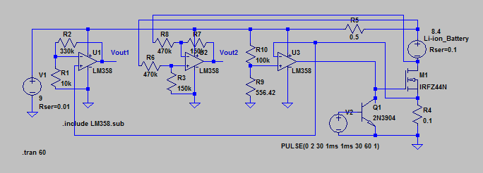
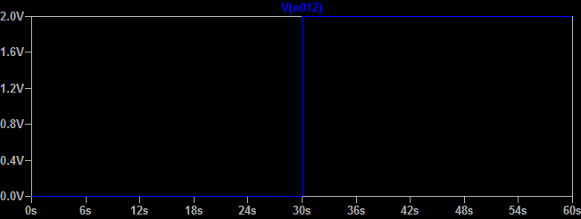
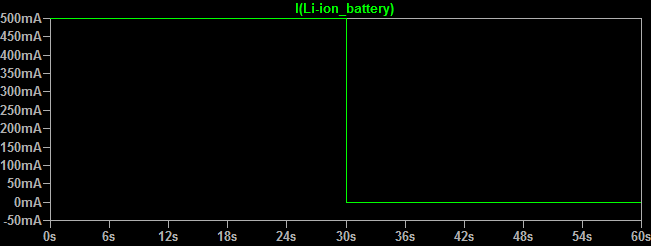
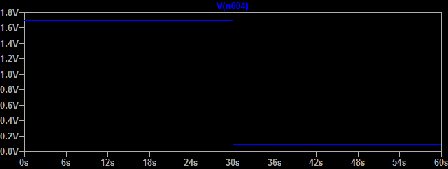

## Li-ion-Battery-Charger-Discharger

I constructed this circuit to measure the capacity of my 7.2V lithium-ion batteries for Sony Camcorders. These batteries are Sony compatible batteries but the real capacity is much lower than the specified capacity. I understand the capacity of the battery can be measured using a hobby battery charger but I cannot fully control the charging/discharging conditions (voltage and current). The goal of this project is to control the charging/ discharging conditions with a microcontroller (STM32F103C8T6).

The components used for this project

1. FreeRTOS

   FreeRTOS v9.0 is used for this project. I divided the operation into three tasks. (1) USB communication, (2) Main measurement and LCD update task, (3) LED blinking to verify the operation of the board. Although FreeRTOS increased the complexity of the project and memory usage, the three tasks are well separated and it simplified the main design.

   

2. USB virtual COM port

   Since I wanted to fully control the circuit and collect data from the experiment, a USB connection is added. I can send commands through a virtual COM port to the battery charger and receive voltage, current, and capacity data from the charger. 

   

3. AD converter

   Two 12 bit AD converters are used to measure the voltage of lithium-ion battery and the charging/discharging current. Due to the breadboard connection, the measured voltage using the AD converter was not very stable. Soldering is required for a better measurement. 

   

4. RTC 
   Real time clock is used to get the time passed from the start of the charging/discharging. This is useful The collected data can have the date/time information. 

   

5. LCD screen (20 characters by 4 lines)
   The LCD screen provides information about voltage, charging/discharging current, current capacity and elapsed time.

   

6. I2C communication

   Since a typical LCD screen requires parallel communication, many lines should be connected between a LCD screen and a micro-controller. This is not desirable. So, a serial I2C communication is used instead. Only four lines are needed (5V, GND, SCL (B6), and SDA (B7)). 

   For I2C communication, the ports (B6 and B7) should be pulled up with a 2K resistor. **Since STM32F103C8T6 does not have a pull up on the ports, a 2K resistor pull up should be connected**. If you want to have a pull up on the ports, you may want to consider STM32F4 instead.

   

The project is initially designed and generated using the STM32CubeMX and built using System Workbench for STM32, a free eclipse based IDE. The project size is larger than 32 Kbytes and Keil MDK-Lite or a free version of IAR is not suitable for this project. As noted above, the performance AD converter was not great and I would not expect much for a $3 ARM development board. To reduce the variation of the voltage and current measurements, exponential moving averages were applied to the measurement. The moving average over 60 measurements were sufficient to make the voltage and current stable.  The exponential moving average is simple and efficient, the moving average is influenced by very old measurements. So, if you do not mind about small amount of memory usage,  a simple moving average will be better in this case.  

The voltage across the lithium-ion battery is up to 8.6V and cannot be directly measured with the microcontroller (3.3V max). Furthermore, the negative terminal of the lithium-ion battery is not sitting on the ground when it is charged. So, I used a differential amplified to reduce the voltage 0.319 times and shift the voltage to the ground.

### The constructed circuit

### Breadboard circuit

### Circuit Schematic Diagram

### LT Spice Simulation Circuit Diagram

The simulation directory has the files (Li-ion_Charger_Circuit_Simulation.asc and lm358.sub) for LT Spice simulation.

### Input Pulse (V2, 30 seconds) to control the NPN transistor

The charging current through the n-channel Power MOSFET (IRFZ44N) is controlled by the ARM microcontroller (STM32F102) by turning on or off the NPN transistor (2N3904) using a digital output port (B5). This process is simulated with a 30 second 2V pulse. The Li-ion battery is charged when the transistor is off (the first 30 seconds) and is not charged when the transistor is on (next picture).

### The charging current (mA) through the lithium ion battery 

The charging current is set to 0.5A.

### The amplified voltage output (Vout1) across the current sensing resistor (0.1 ohm)

The charging current is measured using the current sensing resistor (0.1 ohm). The small voltage across the current sensing resistor is amplified 33 times to Vout1 using the non-inverting amplifier. This voltage is converted to a digital value using a 12 bit ADC of STM32F103 to detect the charging current. When the circuit is not charging (after 30 seconds), the voltage output (Vout1) should be zero. However, the LM358 is a single supply op amp and the lowest voltage output is still significantly above zero. The simulation indicates that it is about 93 mV. Due to this problem, a small measured current should be considered as zero. 

